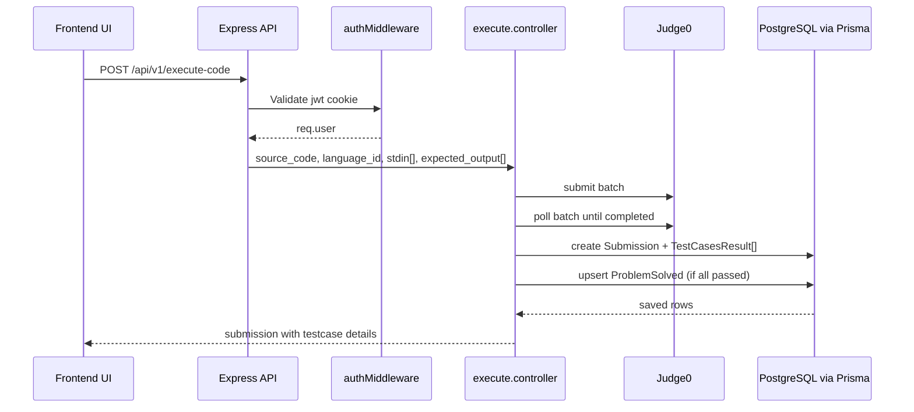

## A Full-Stack Online Coding Platform** where users can write, run, and test code directly in the browser.

The platform integrates a **React frontend, Node.js backend, PostgreSQL database, and Judge0 execution engine** to simulate a mini **online judge system** similar to LeetCode or HackerRank.

---

## ✨ Features

- 🧑‍💻 Online Code Editor
- ⚡ Real-time Code Execution
- 🐳 Docker-based Judge0 Integration
- 📦 PostgreSQL Database with Prisma ORM
- 🔐 Backend API for Code Submissions
- 🌐 Modern React Frontend (Vite)

---

## 🏗 System Architecture

```
User
│
▼
Frontend (React + Vite)
│
▼
Backend API (Node.js + Express)
│
├── PostgreSQL Database (Prisma ORM)
│
▼
Judge0 Execution Engine (Docker)
```

---

## 🛠 Tech Stack

### Frontend
- React
- Vite
- Axios
- Tailwind CSS

### Backend
- Node.js
- Express.js
- Prisma ORM

### Database
- PostgreSQL

### Code Execution
- Judge0
- Docker

---

## 📂 Project Structure

```
CODE-MODE
│
├── frontend/          # React frontend
│
├── backend/           # Express backend API
│
├── prisma/            # Prisma schema & migrations
│
├── docker/            # Judge0 Docker configuration
│
└── README.md
```

---

## ⚙️ Local Setup

### 1️⃣ Clone Repository

```bash
git clone https://github.com/Saikat-Bara479i/CODE-MODE.git
cd CODE-MODE
```

---

### 🔧 Backend Setup

```bash
cd backend
npm install
```

Create `.env` file:

```env
DATABASE_URL="your_postgres_connection_string"
JUDGE0_URL=http://localhost:2358
PORT=5000
```

Run backend:

```bash
npm start
```

---

### 💻 Frontend Setup

```bash
cd frontend
npm install
npm run dev
```

Frontend runs at:  
**http://localhost:5173**
For more detail go to **https://github.com/judge0/judge0/blob/master/CHANGELOG.md**

---

### 🐳 Running Judge0

Install Docker, then:

```bash
git clone https://github.com/judge0/judge0.git
cd judge0
docker compose up -d
```

Judge0 API will be available at:  
**http://localhost:2358**

---

### 🗄 Database Setup

```bash
npx prisma migrate dev
npx prisma generate
```

---

## 📸 Screenshots

*(Add screenshots of your UI here)*

Examples:

```text
screenshots/editor.png
screenshots/output.png
screenshots/submission.png
```

---

## 📈 Future Improvements

- User Authentication improvement with OpenID( OAuth)
- Problem Library & Categories
- Online Coding Contests
- Leaderboard System
- Code Submission History
- AI-based Code Suggestions / Autocomplete

---

## 🤝 Contributing

Contributions are welcome!

1. Fork the repository
2. Create your feature branch (`git checkout -b feature/amazing-feature`)
3. Commit your changes (`git commit -m 'Add some amazing feature'`)
4. Push to the branch (`git push origin feature/amazing-feature`)
5. Open a Pull Request

---

## 👨‍💻 Author

**Saikat Barai**  
GitHub: [https://github.com/Saikat-Bara479i](https://github.com/Saikat-Bara479i)

---

## Flow🚤
Admin
  │
  ▼
Create Problem
  │
  ├── Add Test Cases
  ├── Add Code Snippet
  └── Add Reference Solution
  │
  ▼
Validate using Judge0
  │
  ├── Execute Code
  ├── Compare StdOut with Expected Output
  │
  ▼
If Valid → Save Problem in Database


User
  │
  ▼
Fetch Problem
  │
  ▼
Write Code
  │
  ▼
Execute Code
  │
  ▼
Run Against Test Cases
  │
  ├── Test Case 1
  ├── Test Case 2
  ├── Test Case 3
  │
  ▼
If Any Test Case Fails ❌
   Stop Execution
Else ✅
   Save Submission
# Project Architecture Diagram

```mermaid
flowchart LR
    U[User or Admin Browser]

    subgraph FE[Frontend - React + Vite]
      R[React Router Pages\nHome/Login/Signup/Problem/AddProblem]
      Z[Zustand Stores\nuseAuth/useProblem/useExecution/useSubmission]
      AX[Axios Client\nbaseURL /api/v1\nwithCredentials=true]
      R --> Z --> AX
    end

    subgraph BE[Backend - Node.js + Express]
      EX[Express App\nindex.js]
      MW[Auth Middleware\nJWT from httpOnly cookie]

      subgraph API[Route Groups]
        A1[/auth]
        A2[/problems]
        A3[/execute-code]
        A4[/submissions]
        A5[/playlists]
      end

      subgraph CTRL[Controllers]
        C1[auth.controller]
        C2[problem.controller]
        C3[executecode.controller]
        C4[submission.controller]
        C5[playlist.controller]
      end

      DBL[Prisma Client db.js]
      J0[judge0.libs.js\nsubmit batch + poll results]

      EX --> MW
      MW --> API
      API --> CTRL
      CTRL --> DBL
      C3 --> J0
    end

    PG[(PostgreSQL\nPrisma schema)]
    JUDGE[[Judge0 API\nExternal Code Execution]]

    AX -->|HTTP + Cookie JWT| EX
    DBL --> PG
    J0 --> JUDGE

    subgraph MODELS[Core DB Models]
      M1[User]
      M2[Problem]
      M3[Submission]
      M4[TestCasesResult]
      M5[ProblemSolved]
      M6[Playlist + ProblemPlaylist]
    end

    PG --- MODELS
```

## Main request flow




